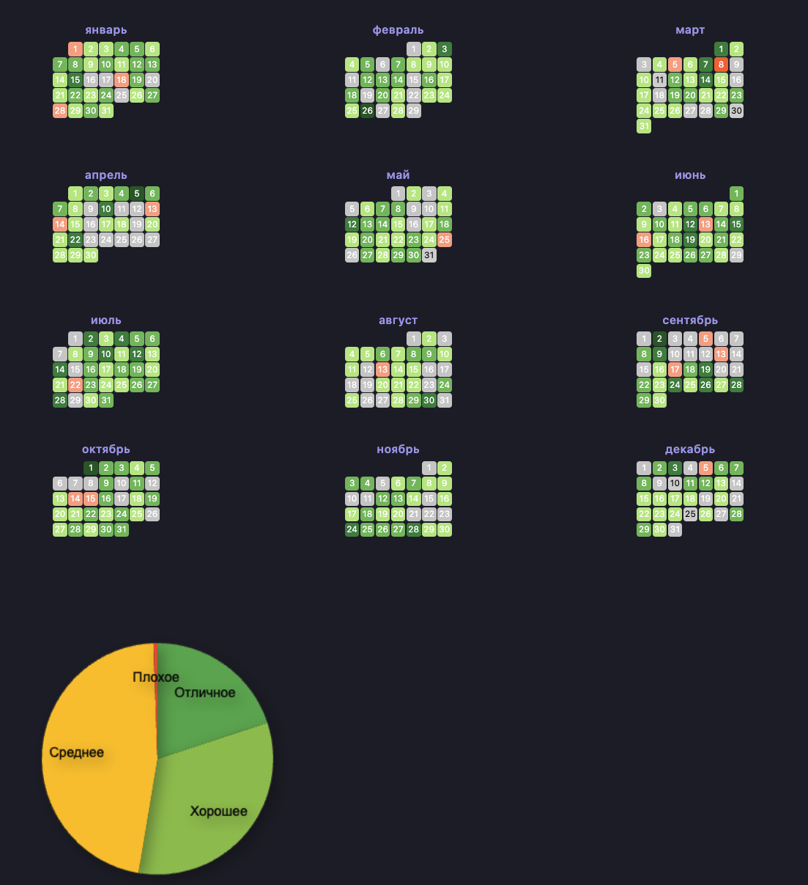

# LifeTracker - Система персональной аналитики в Obsidian


Персонализированная система трекинга метрик здоровья и продуктивности с расширенной визуализацией данных.

<div align="center">
  
</div>

## Требования
- [Obsidian](https://obsidian.md) v1.4+
- Плагины:
  - [Templater](https://github.com/SilentVoid13/Templater) v1.21.0+
  - [Dataview](https://github.com/blacksmithgu/obsidian-dataview) v0.5.45+

## Установка
1. **Создайте новое хранилище**:
```bash
mkdir BiohackingVault
cd BiohackingVault
mkdir Daily
```

2. **Настройте Templater**:
- Создайте шаблон `Templates/DailyNote.md`:
```markdown
---
created: {{date:YYYY-MM-DD}}
---

# {{date:YYYY-MM-DD}}
sleep: 
Mood: 
sport: 
cognitive: 
```

3. **Добавьте файл визуализации**:
- Создайте `Biohacking Table.md` и вставьте [приведённый код](Biohacking%20Table.md)

## Конфигурация данных

### Формат ежедневных записей
```markdown
sleep: 7  # 1-10
Mood: 8   # 1-10 
sport: 3   # 1-10
cognitive: 6  # 1-10
```

### Основные параметры (Biohacking Table.md)
```javascript
// Основные настройки
const PROPERTY_FIELDS = ["sport", "Mood", "cognitive", "sleep"];
const VAULT_NAME = "BiohackingVault"; 
const NOTES_FOLDER = "Daily";
const CELL_SIZE = 15; // Размер ячеек календаря

// Цветовая схема
const HUE_RED = 13;    // Красный спектр
const HUE_GREEN = 132; // Зелёный спектр
```

## Визуализация данных

Система предоставляет три типа аналитики в одном файле:

### 1. Годовой календарь активности
- Цветовая градация от красного (низкие значения) до зелёного (высокие)
- Интерактивные ссылки на ежедневные заметки
- Автоматическое определение пропущенных дней

### 2. Круговая диаграмма распределения
- Категории: Отличное, Хорошее, Среднее, Плохое
- Анимированные секции с тенями
- Интерактивные подписи категорий

### 3. Трендовый график за год
- Динамика средних значений по месяцам
- Точечная визуализация с точными значениями
- Адаптивная сетка и оси координат

## Кастомизация

### 1. Изменение метрик
```javascript
// В секции PROPERTY_FIELDS
const PROPERTY_FIELDS = ["new_metric1", "new_metric2"]; 
```

### 2. Настройка внешнего вида
```javascript
// Размеры элементов
const CELL_SIZE = 20;      // Календарь
const CHART_RADIUS = 150;  // Диаграмма

// Цветовые схемы
const COLORS = ["#4caf50", "#8bc34a", "#ffc107", "#f44336"]; // Для диаграммы
```

### 3. Формулы расчётов
```javascript
// Логика категоризации (в секции круговой диаграммы)
if (average >= 7) { ... } // Измените пороговые значения
```

## Структура проекта
```
BiohackingVault/
├── Daily/
│   └── YYYY-MM-DD.md
├── Templates/
│   └── DailyNote.md
└── Biohacking Table.md
```
